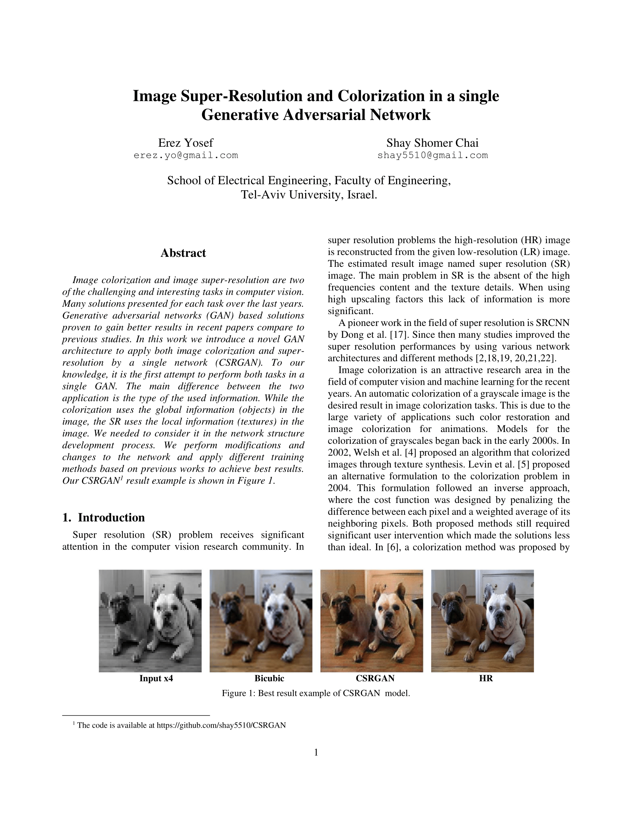
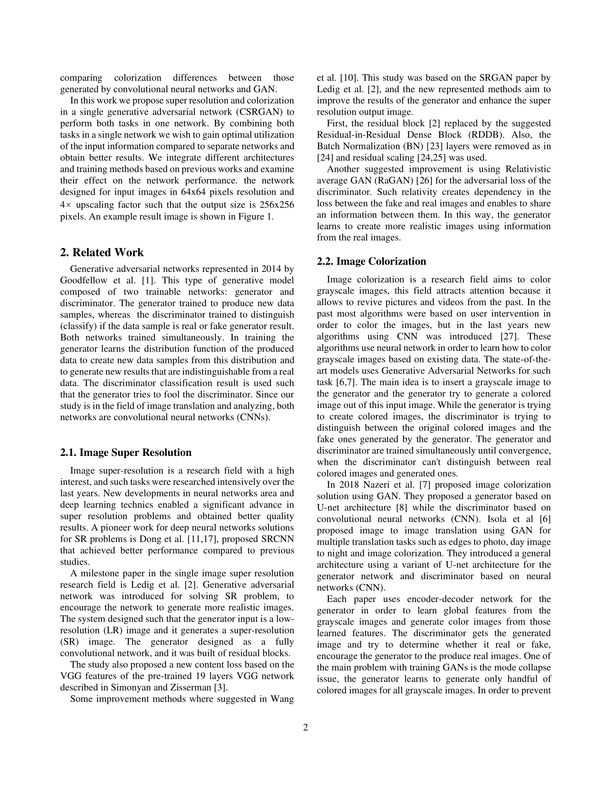
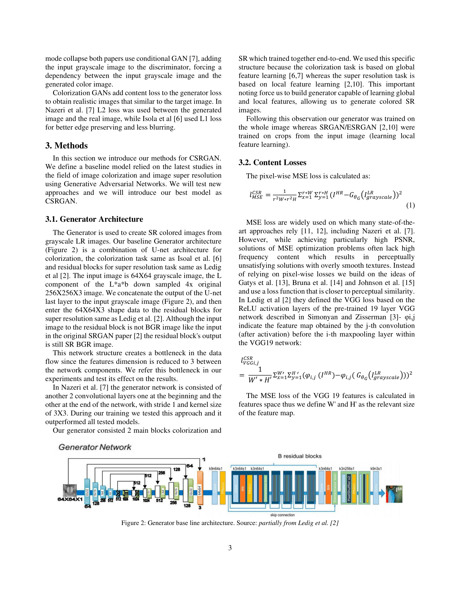
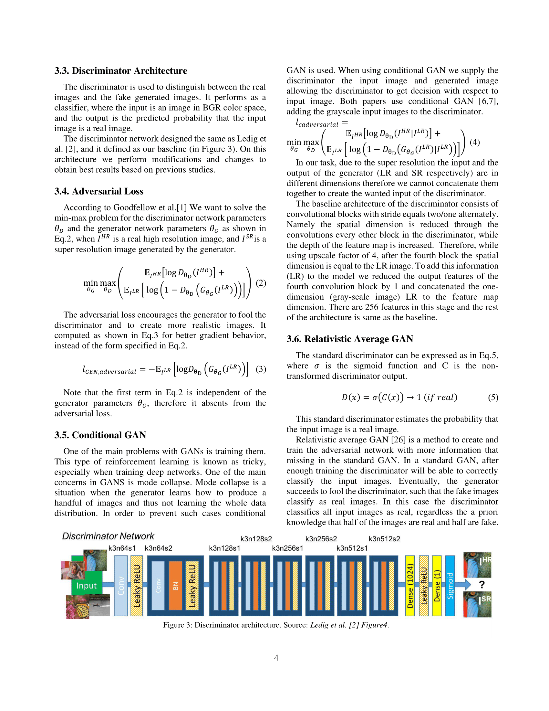
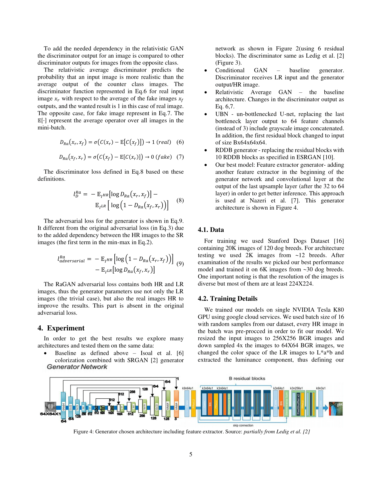
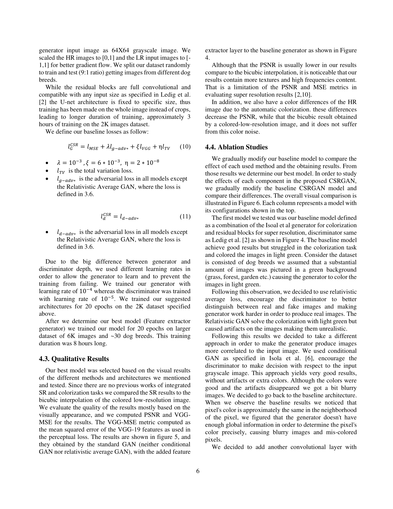
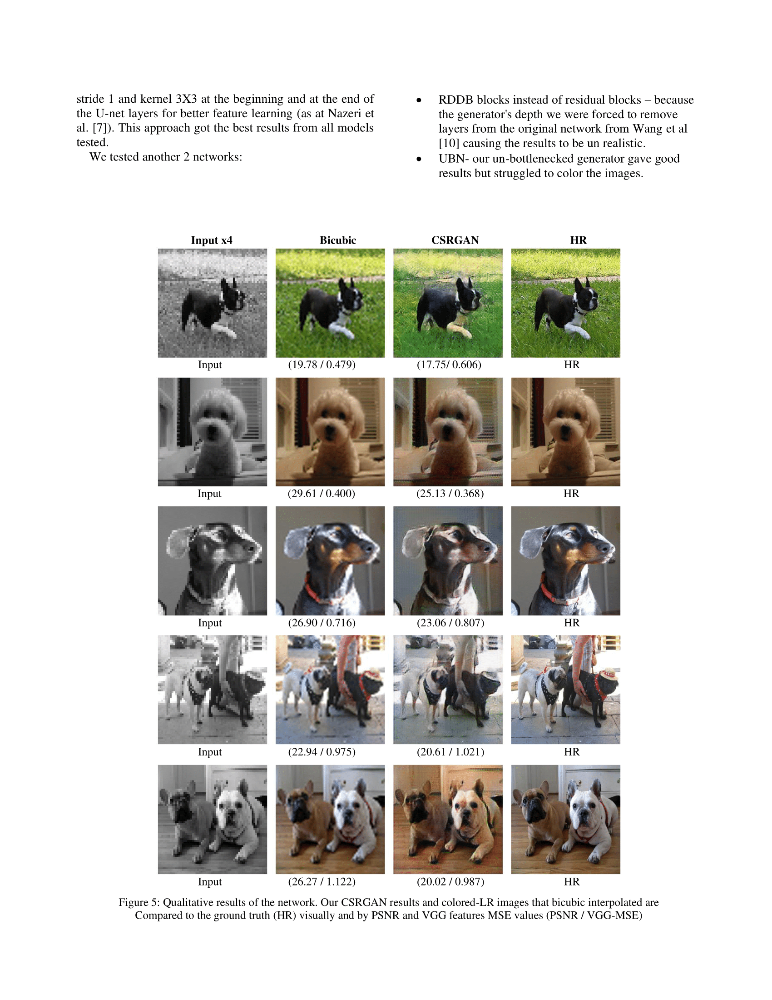
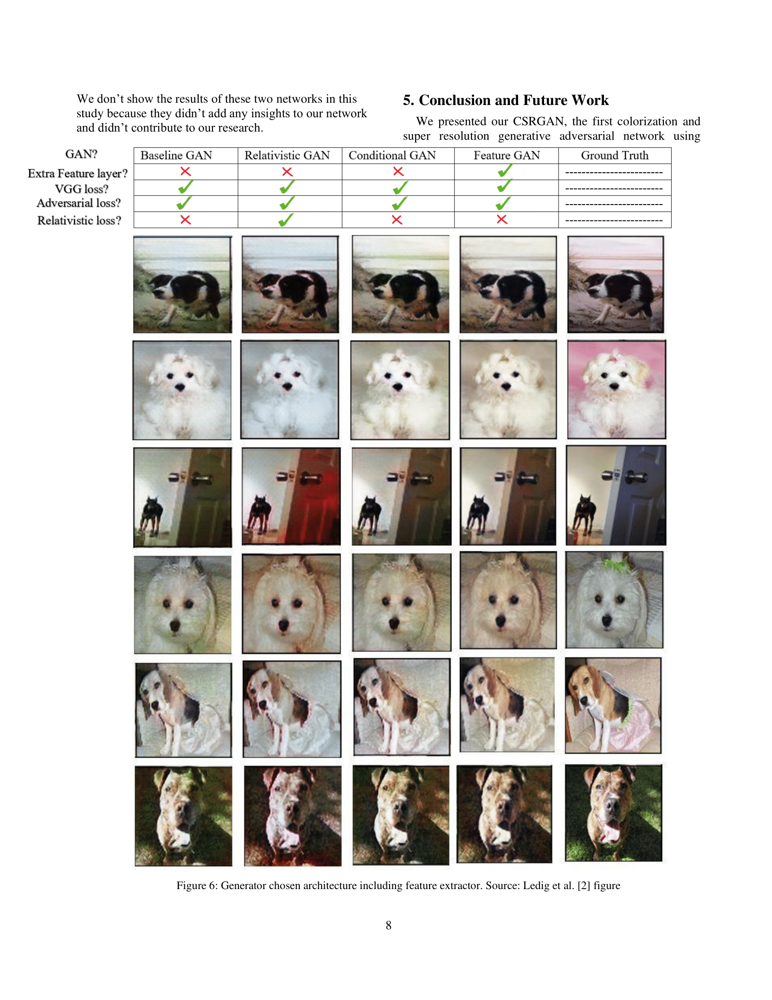
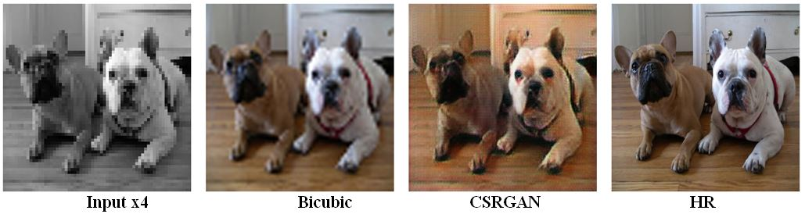

# CSRGAN

*Official PyTorch implementation of the our paper:* [](PDFS/CSRGAN.pdf)
<p align="center">
<i><a href="PDFS/CSRGAN.pdf">Image Super-Resolution and Colorization in a single Generative Adversarial Network<br>Erez Yosef and Shomer Chai<br></a></i>
<a href="PDFS/CSRGAN.pdf"></a>
<a href="PDFS/CSRGAN.pdf"></a>
<a href="PDFS/CSRGAN.pdf"></a>
<a href="PDFS/CSRGAN.pdf"></a>
<a href="PDFS/CSRGAN.pdf"></a>
<a href="PDFS/CSRGAN.pdf"></a>
<a href="PDFS/CSRGAN.pdf"></a>
<a href="PDFS/CSRGAN.pdf"></a>
<a href="PDFS/CSRGAN.pdf"></a>
</p>

## Overview
Using **single GAN** to perform the two tasks:
* Image Colorization
* Image Super resolution

Generator Input:
* Grayscale low resolution image (64x64)
Generator Output:
* Colored High resolution image (256x256) 

## Requirments 

```
conda env create -f requirments.yml
```

## Dataset 
In this paper we used [Stanford University dogs dataset](http://vision.stanford.edu/aditya86/ImageNetDogs/)<br/>
This dataset contains:<br/>
Number of dog breeds: 120<br/>
Number of images: 20,580<br/>
**The images are in different resolution thus we add resize(256X256) to the preprocess**<br/><br/>
We use small portion of the dataset: ~30 different dog breeds ~6K images.<br/> 
We splited our dataset to train and test with respect to the different dog breeds.<br/>
Train: ~5400 images<br/>
Test: ~560 images<br/>

## Training Details
We used google cloud services in order to train our model - using:<br/>
- 1 GPU - Tesla K80 
- 2 CPU - 13GB RAM

We trained our mode for 21 epochs, approximately 8hr.<br/>

## Training Models
- [GeneratorFeatures](code/Generator_feature_extractor.py)
- [Generator](code/Generator.py)
- [GeneratorBroken63](code/Generator_break_63_plus_1.py)
- [GeneratorRRDB](code/Generator_RRDB.py)<br/>

**For each Generator one can use regular GAN or Conditional GAN(example downwards)**

## Train 
Input arguments for [train.py](train.py):
```
--epochs                | default=21   
--saveparams_freq_batch | default=5    
--saveimg_freq_step     | default=100  
--lrG                   | default=1e-4 
--lrD                   | default=1e-5 
--train_path            | default='./data/6k_data/train'
--test_path             | default='./data/6k_data/test'
--type_of_dataset       | default="10_dogs"
--fname                 | default=""
--generator             | default="GeneratorFeatures"
--discriminator         | default="Discriminator"
--batch_size            | default=16
```
- command line for our default model(regular GAN - GeneratorFeatures)
```
python train.py
```
- command line for different model(Conditional GAN - GeneratorBroken63) 
```
python train.py --generator GeneratorBroken63 --discriminator Conditional_Discriminator
```
## Outputs - Train
The code creates out dirs - training results\\<MONTHDD_HH_MM>\ (for example: training_results\Jan28_21_23\) with 3 subdirs: 
- params - weights saved every 5 epochs ( input argument --saveparams_freq_batch)
- SR_results - images generated by the generator every 100 steps(from trainset) and every 1 epoch(form testset) (input argument --saveimg_freq_step)
- train_data - summary csv and tensorboard results

## Test
Input arguments for [test.py](test.py)
```
--train_path            | default='./data/6k_data/train'
--test_path             | default='./data/6k_data/test'
--type_of_dataset       | default="10_dogs"
--fname                 | default=""
--params_path           | default="params/6k_params/netG_epoch_20.pth"
--batch_size            | default=16
```

```
python test.py
``` 

**The test script is implemented for our best model: GeneratorFeatures** 

## Outputs - Test 
The test script creates new dir - test_results where we can find colorized super resolution images generated by our GeneratorFeatures. 


## Examples 
<br/><br/><br/>

